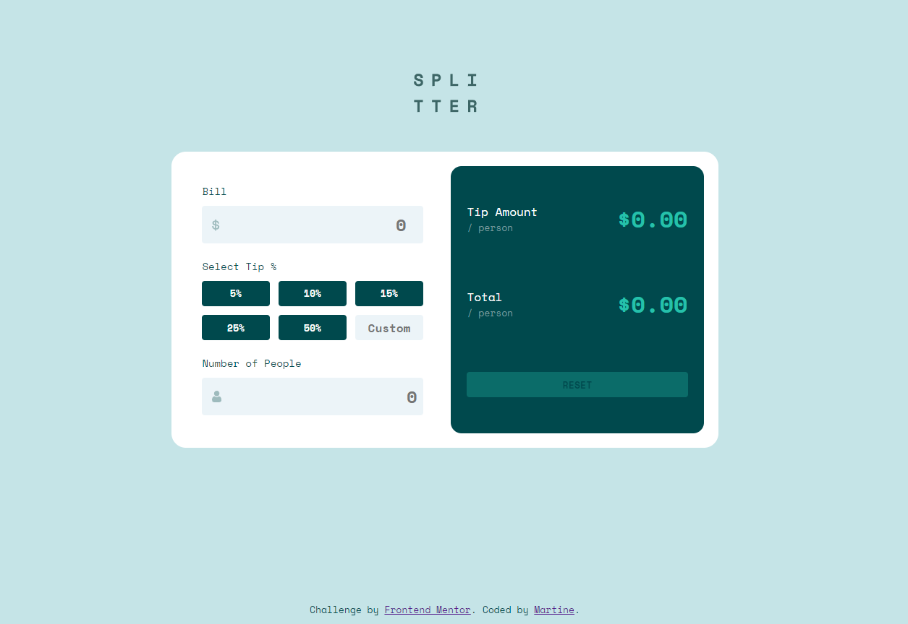

# Frontend Mentor - Tip calculator app solution

This is a solution to the [Tip calculator app challenge on Frontend Mentor](https://www.frontendmentor.io/challenges/tip-calculator-app-ugJNGbJUX). Frontend Mentor challenges help you improve your coding skills by building realistic projects.

## Table of contents

- [Overview](#overview)
  - [The challenge](#the-challenge)
  - [Screenshot](#screenshot)
  - [Links](#links)
- [My process](#my-process)
  - [Built with](#built-with)
  - [What I learned](#what-i-learned)
  - [Continued development](#continued-development)
  - [Useful resources](#useful-resources)
- [Author](#author)

## Overview

### The challenge

Users should be able to:

- View the optimal layout for the app depending on their device's screen size
- See hover states for all interactive elements on the page
- Calculate the correct tip and total cost of the bill per person

### Screenshot

### Links

- Solution URL: [SOLUTION](https://www.frontendmentor.io/solutions/responsive-tip-calculator-using-grid-layout-and-js-p_qkjjoV6K)
- Live Site URL: [LIVE SITE](https://endearing-sprite-ca2003.netlify.app/)

## My process

### Built with

- Semantic HTML5 markup
- CSS custom properties
- CSS Grid
- Mobile-first workflow

### What I learned

I've learnt more about using grid to make a responsive layout as well as being able to calculate values from input fields after converting them to a number with parseFloat.

### Continued development

I want to contiue with using grid layout and also continue to and make more advanced forms for calculating with JavaScript.

### Useful resources

- [Grid Layout](https://travishorn.com/responsive-grid-in-2-minutes-with-css-grid-layout-4842a41420fe) helped me setup my grid layout.

## Author

- Frontend Mentor - [@MarSkor](https://www.frontendmentor.io/profile/MarSkor)
