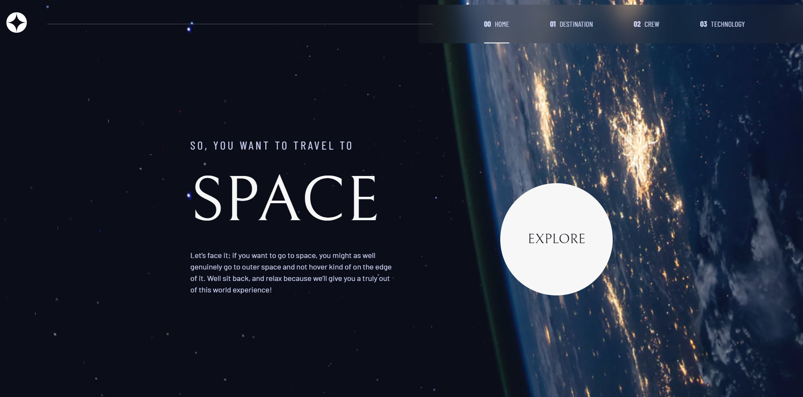

# Frontend Mentor - Space tourism website solution

This is a solution to the [Space tourism website challenge on Frontend Mentor](https://www.frontendmentor.io/challenges/space-tourism-multipage-website-gRWj1URZ3). Frontend Mentor challenges help you improve your coding skills by building realistic projects.

## Table of contents

- [Overview](#overview)
  - [The challenge](#the-challenge)
  - [Screenshot](#screenshot)
  - [Links](#links)
- [My process](#my-process)
  - [Built with](#built-with)
  - [What I learned](#what-i-learned)
  - [Continued development](#continued-development)
- [Author](#author)

**Note: Delete this note and update the table of contents based on what sections you keep.**

## Overview

### The challenge

Users should be able to:

- View the optimal layout for each of the website's pages depending on their device's screen size
- See hover states for all interactive elements on the page
- View each page and be able to toggle between the tabs to see new information

### Screenshot

### Links

- Solution URL: [SOLUTION](https://www.frontendmentor.io/solutions/responsive-space-tourism-website-0cHeHVa4DN)
- Live Site URL: [LIVE URL](https://mellow-puppy-53cffc.netlify.app/)

### Built with

- Semantic HTML5 markup
- SCSS
- Flexbox
- CSS Grid
- Mobile-first workflow
- [React](https://reactjs.org/) - JS library
- [Next.js](https://nextjs.org/) - React framework

### What I learned

I have learnt a lot more about grid layout and its use of templates.

### Continued development

I will focus more on grid/flexbox and more use of animations in react/next to create more beautiful websites.

## Author

- Website - [martinessk.com](https://www.martinessk.com/)
- Frontend Mentor - [@MarSkor](https://www.frontendmentor.io/profile/MarSkor)
- Twitter - [@marskor\_](https://twitter.com/marskor_)
